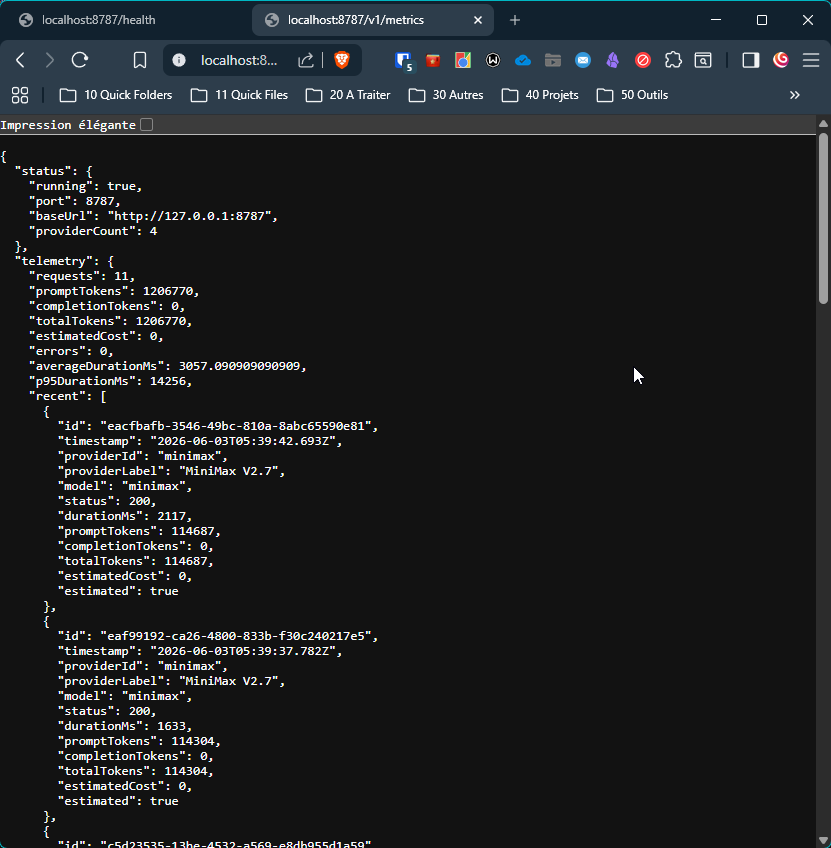

# AIFlowBridge

<!-- markdownlint-disable MD033 -->
<p align="center">
  <hr/>
</p>
<p align="center">
  <a href="https://marketplace.visualstudio.com/items?itemName=LaurentOngaro.aiflowbridge">
    
  </a>
  <a href="https://github.com/LaurentOngaro/aiflowbridge">
    
  </a>
  <a href="https://github.com/LaurentOngaro/aiflowbridge/stargazers">
    
  </a>
  <a href="https://github.com/LaurentOngaro/aiflowbridge/blob/main/LICENSE">
    
  </a>
  <a href="https://github.com/LaurentOngaro/aiflowbridge/issues">
    
  </a>
  <a href="https://github.com/LaurentOngaro/aiflowbridge/releases/latest">
    
  </a>
</p>
<!-- markdownlint-enable MD033 -->

**Use DeepSeek, MiniMax, and Xiaomi MiMo directly in GitHub Copilot Chat. The extension is free, open-source, and ad-free; you pay the upstream providers directly for the model usage. Transparent vision proxy, usage metrics, and an OpenAI-compatible local gateway for Kilo Code, Continue, and more.**

AIFlowBridge brings together multiple AI providers (DeepSeek, MiniMax, Xiaomi MiMo) under a unified interface inside Copilot Chat - with built-in metrics, proxy routing, and vision bridge capabilities.

> **AIFlowBridge can save you time or money, so consider [sponsoring its development](https://github.com/sponsors/LaurentOngaro)**.
> The extension is free, ad-free, tracker-free and no personal data is collected - **your support is what keeps it that way ->[more info on how to become one of our sponsor](#sponsoring)**
>
> **Spread the word**
> 
> Increase the project's visibility by adding a star to its GitHub repository
>
> **That's the easiest way to show your support and help others discover the extension**

## Features

- **Multi-provider in one place** - DeepSeek (V4 Pro, V4 Flash), MiniMax (M2, M2.1, M2.1 Highspeed, M2.5, M2.5 Highspeed, M2.7, M2.7 Highspeed, M3), Xiaomi MiMo (V2 Omni, V2 Pro, V2.5, V2.5 Pro). See the [Providers](#providers) table for the canonical list and which ones have **native** vision vs use the [vision proxy](#vision-proxy). To add a model not in the list, run **`AIFlowBridge: Add a custom model`** (see [Adding a model without waiting for a release](#adding-a-model-without-waiting-for-a-release)).
- **Transparent vision proxy** - text-only models handle images via automatic proxy through another installed Copilot model (Claude, GPT-4o, etc.). Zero configuration required; pick your preferred vision model once.
- **Built-in OpenAI-compatible gateway** - starts automatically on port 8787 (singleton across VS Code instances) so Kilo Code, Continue, Open WebUI, and any OpenAI-compatible client can use the same models. Per-request metrics, tokens, and estimated cost, persisted across restarts.
- **Copilot Chat integration** - agent mode, tool calling, instructions, MCP, skills. 1M token context on supporting models. Thinking mode with reasoning effort control (DeepSeek, Xiaomi).
- **Secure by default** - API keys in VS Code's `SecretStorage` (OS keychain), never in `settings.json` or in Git history. Telemetry stays local.

## Why AIFlowBridge?

GitHub Copilot Chat ships with one vendor. AIFlowBridge adds a multi-provider switcher so you can pick the best model for the job, all from the same chat window.

Compared to running each provider's CLI or website, AIFlowBridge gives you:

- **One place** to switch models in Copilot Chat (no copy-pasting code between sites)
- **Local OpenAI-compatible gateway** so Kilo Code, Continue, Open WebUI, and any OpenAI-compatible client can use the same models
- **Per-request metrics**: token counts, latency, estimated cost - visible in the dashboard
- **Vision proxy** for text-only models: paste an image and the description is injected automatically
- **Local-first**: API keys live in your OS keychain, telemetry stays on your machine

**Want to use a model not in the list?** Run **`AIFlowBridge: Add a custom model`** from the Command Palette to add any model returned by the provider's `/v1/models` endpoint - see [Adding a model without waiting for a release](#adding-a-model-without-waiting-for-a-release).

## Cost comparison - what's real, what isn't

AIFlowBridge is **local glue** around paid upstream APIs. It does not replace those APIs and it does not magically lower their per-token prices. Anything that says otherwise is marketing.

What it **does** affect:

- **Free vision for Copilot subscribers.** Models that do not accept images (DeepSeek, MiniMax, Xiaomi text-only) handle them via a _vision proxy_. The default vision model is `oswe-vscode-prime`, which is bundled with a GitHub Copilot subscription. If you already pay for Copilot, vision calls cost **$0** through AIFlowBridge instead of paying a vision-capable upstream model.
- **No markup on token prices.** Other OpenAI-compatible proxies (OpenRouter, Portkey, Together, etc.) add 5–15% on top of the catalog price. AIFlowBridge calls upstream APIs directly with your own API keys - the price you see on the provider's dashboard is the price you pay.
- **One bill per task, not per provider.** Switching between DeepSeek Flash ($0.14/M input) for boilerplate and MiniMax M3 for the hard stuff happens inside the same Copilot Chat window, with per-request token counts. You avoid paying a single premium model for every interaction.
- **Accurate token counting (v1.2+).** The dashboard and the cost estimate for MiniMax (and future models that exposes tokens count through their API) use the upstream endpoint instead of a `length/4` heuristic. No end-of-month surprise.
- **No subscription, no per-seat fee.** AIFlowBridge itself is free; you only pay the upstream APIs you actually use.

What it **does not** do:

- Discounts or rebates on upstream pricing
- Free trial credits
- Bundled inference

Typical monthly spend for a solo developer using AIFlowBridge (heavy Copilot-style use, ~50 M input + 20 M output tokens):

| Workload                                              | Approx. cost                      |
| ----------------------------------------------------- | --------------------------------- |
| All DeepSeek V4 Flash                                 | $3–5                              |
| Mixed: 70% Flash + 30% MiniMax M3                     | $5–8                              |
| Mostly MiniMax M3 (1 M context)                       | $8–12                             |
| Vision-heavy with `oswe-vscode-prime` proxy (Copilot) | **+ $0** - covered by Copilot sub |
| AIFlowBridge itself                                   | **$0** + optional sponsorship     |

The cheapest "Copilot Chat with image paste" workflow is AIFlowBridge + DeepSeek V4 Flash + the bundled Copilot vision model. There is no cheaper stack that gives you the same feature set in a single UI.

## Providers

| Provider | Models                                                               | Vision     | Tool Calling |
| -------- | -------------------------------------------------------------------- | ---------- | ------------ |
| DeepSeek | V4 Flash, V4 Pro                                                     | Proxied    | ✅           |
| MiniMax  | M2, M2.1, M2.1 Highspeed, M2.5, M2.5 Highspeed, M2.7, M2.7 Highspeed | Proxied    | ✅           |
| MiniMax  | M3                                                                   | **Native** | ✅           |
| Xiaomi   | MiMo V2 Omni                                                         | Native     | ✅           |
| Xiaomi   | MiMo V2 Pro, V2.5 Pro                                                | Proxied    | ✅           |
| Xiaomi   | MiMo V2.5                                                            | **Native** | ✅           |

Notes:

- All models expose the image-paste button in Copilot Chat. **Native** models accept images directly. **Proxied** models route the image through a separate vision-capable model that produces a text description, which is then injected into the prompt (see [Transparent Vision Proxy](#vision-proxy)).
- "Thinking" indicates a reasoning model with a thinking-effort selector exposed in Copilot Chat. MiniMax M2/M2.1/M3 generations do not expose a thinking selector.
- Configure the proxied vision model with `AIFlowBridge: Set vision proxy model` or via `aiflowbridge.vision.copilotVisionModel`.

### Why is the model list hardcoded?

The list of officially supported models lives in [`src/consts.ts`](src/consts.ts) and is **not auto-discovered** from the upstream APIs. This is a deliberate design choice driven by VS Code's `vscode.lm.registerLanguageModelChatProvider` API.

VS Code requires each model to declare its capabilities at registration time:

- `maxInputTokens` and `maxOutputTokens` (context window)
- `toolCalling` - `true`, `false`, or a numeric limit on simultaneous tools
- `imageInput` - whether the paste-image button appears in Copilot Chat
- `thinking` - whether the thinking-effort selector is exposed
- `requiresThinkingParam` - provider-specific quirks (e.g. DeepSeek's `thinking: { type: "enabled" }`)

The upstream APIs (`GET /v1/models`) only return `{ id, owned_by, created }`. They do not expose context window, tool limits, vision support, or thinking support in a usable format. Without explicit capabilities, VS Code would:

- Hide the image-paste button for vision-capable models
- Expose tool calling for models that don't support it (broken UX)
- Skip the thinking-effort selector for reasoning models
- Allow context overflow with no warning

A bad capability is a worse user experience than a missing model. Hardcoding ensures every supported model works end-to-end on day one.

**Convention** : the `id` field in `MODELS` is the **upstream API id** itself (e.g. `MiniMax-M2.7`, `mimo-v2.5-pro`), not a kebab-case VS Code alias. The picker shows the human-readable `name` field. This avoids any id translation layer between VS Code and the upstream API.

### Adding a model without waiting for a release

You do **not** need a new AIFlowBridge release to use a newly released provider model. Two options:

#### Option 1 - Command Palette (easiest)

Run **`AIFlowBridge: Add a custom model`** from the Command Palette. The command:

1. Asks which provider to query
2. Fetches the model list from the provider's `/v1/models` endpoint (using your stored API key)
3. Lets you pick a model from the list
4. Lets you pick its capabilities (tool calling, vision, thinking) with simple Yes/No prompts
5. Saves the entry to your `aiflowbridge.userModels` setting

The new model appears in the Copilot Chat picker immediately. You can edit or remove the entry in your user settings at any time.

#### Option 2 - Direct setting

Add an entry to `settings.json` under `aiflowbridge.userModels`:

```json
{
  "aiflowbridge.userModels": [
    {
      "id": "minimax-m3",
      "name": "MiniMax M3",
      "family": "minimax",
      "version": "m3",
      "maxInputTokens": 1000000,
      "maxOutputTokens": 128000,
      "capabilities": {
        "toolCalling": true,
        "imageInput": true,
        "thinking": false
      },
      "requiresThinkingParam": false
    }
  ]
}
```

**Trade-off** : user-declared models are your responsibility. If you mark `imageInput: true` for a model that does not accept images, the Copilot Chat paste button will appear but the model will fail on upload. Capabilities are not validated against the upstream API.

### Promoting a user model to the official registry

If a user-defined model is widely useful, the recommended path is to add it to the official registry in `src/consts.ts` via a pull request. The PR will be reviewed for:

- Correct `id` matching the upstream API exactly (use `AIFlowBridge: Add a custom model` or `curl /v1/models` to confirm)
- Correct capabilities (especially image input and thinking)
- Matching `maxInputTokens` / `maxOutputTokens` from the provider's documentation
- Translation key in `package.nls.json` (`model.<id>.detail`)
- Entry in the Providers table above

The release cadence is opportunistic - no fixed schedule. Tag `v1.x.y` when a meaningful set of changes accumulates.

## Installation

### Prerequisites

- VS Code 1.90 or later
- GitHub Copilot subscription (Free / Pro / Enterprise)
- At least one API key from a supported provider

### Install the Extension

1. Open VS Code
2. Go to Extensions (`Ctrl+Shift+X`)
3. Search for "AIFlowBridge"
4. Click Install

Or install from the [VS Code Marketplace](https://marketplace.visualstudio.com/items?itemName=LaurentOngaro.aiflowbridge).

### Configure API Keys

Run the appropriate command from the Command Palette (`Ctrl+Shift+P`):

```
DeepSeek: Set API Key
MiniMax: Set API Key
Xiaomi MiMo: Set API Key
```

API keys are stored securely in your OS keychain via VS Code's SecretStorage.

## Demo

Once installed, the metrics dashboard is one keyboard shortcut away: press **`Ctrl+Alt+M`** (or `Cmd+Alt+M` on macOS), or run `AIFlowBridge: Show metrics dashboard` from the Command Palette.

### Screenshots

| Dashboard (v1.1.1)                                                                      | Copilot picker (v1.1.1)                                                            | Kilo Code picker (v1.1.1)                                                             |
| --------------------------------------------------------------------------------------- | ---------------------------------------------------------------------------------- | ------------------------------------------------------------------------------------- |
|  |  |  |

| Vision proxy (v1.1.1)                                                                           | Gateway health (v1.1.1)                                                | Gateway metrics (v1.1.1)                                                 |
| ----------------------------------------------------------------------------------------------- | ---------------------------------------------------------------------- | ------------------------------------------------------------------------ |
|  |  |  |

| Output log (v1.1.1)                                                | Settings (v1.1.1)                                                |
| ------------------------------------------------------------------ | ---------------------------------------------------------------- |
|  |  |

### What the dashboard shows

- **Totals**: requests, prompt/completion tokens, estimated cost
- **By model**: requests, tokens, and **Est. cost** sliced by model ID, with time filters (All / Last 1h / 24h / 7d / 30d)
- **Recent requests table**: timestamp, model, tokens, latency, status, **Est. cost** (with the same time filters)
- **Provider summary**: requests, tokens, and **Est. cost** by DeepSeek / MiniMax / Xiaomi

The status bar shows the current gateway state (running / stopped / error).

### Estimated cost and pricing

The **Est. cost** column shows the cost of each request (or the aggregated total for the row), computed as:

```
cost = (promptTokens * pricing.inputPerMillion
      + completionTokens * pricing.outputPerMillion) / 1_000_000
```

**Indicative defaults** — AIFlowBridge ships with indicative per-million-token rates for the token-plan vendors (MiniMax, Xiaomi MiMo) so the dashboard shows non-zero costs out of the box. The current family-level defaults are:

| Family             | Input / 1M | Output / 1M | Applies to                                                                                  |
| ------------------ | ---------- | ----------- | ------------------------------------------------------------------------------------------- |
| MiniMax            | $0.30      | $1.20       | M2, M2.1, M2.1 Highspeed, M2.5, M2.5 Highspeed, M2.7, M2.7 Highspeed, M3                   |
| Xiaomi MiMo        | $0.10      | $0.30       | V2 Omni, V2 Pro, V2.5, V2.5 Pro                                                             |

Every model in `MODELS` is auto-synthesized into the gateway catalog with the appropriate family rate, so the [complete default `settings.json`](.#configuring-gateway-providers) covers all 14 models without any user input.

These are **estimates**, not a quote. The actual tariff depends on your plan tier, region (Xiaomi ships separate plans per cluster: `token-plan-ams`, `token-plan-sgp`, `token-plan-cn`), and whether you use token-plan keys (`tp-*`) or pay-as-you-go. The per-row tooltip on each Est. cost cell shows the rate that was used to compute it.

**Overriding the pricing** — add a `pricing` block to the matching provider entry in `aiflowbridge.providers` (in `settings.json`). User-configured values always win over the built-in defaults. Example:

```json
{
  "aiflowbridge.providers": [
    {
      "id": "minimax",
      "label": "MiniMax V2.7",
      "kind": "openai-compat",
      "baseUrl": "https://api.minimax.io/v1",
      "model": "MiniMax-M2.7",
      "enabled": true,
      "pricing": {
        "inputPerMillion": 0.3,
        "outputPerMillion": 1.2,
        "currency": "USD"
      }
    },
    {
      "id": "xiaomi",
      "label": "Xiaomi MiMo V2.5 Pro (AMS)",
      "kind": "openai-compat",
      "baseUrl": "https://token-plan-ams.xiaomimimo.com/v1",
      "model": "mimo-v2.5-pro",
      "enabled": true,
      "pricing": {
        "inputPerMillion": 0.1,
        "outputPerMillion": 0.3,
        "currency": "EUR"
      }
    }
  ]
}
```

User-declared models added via `aiflowbridge.userModels` (or the **AIFlowBridge: Add a custom model** command) inherit the family-level default pricing automatically — so a custom MiniMax-M3 model gets the same indicative rate as the built-in MiniMax M2.7 profile. Override it the same way by adding a `pricing` block to the synthesized provider entry.

Providers without a `pricing` block show `—` in the Est. cost column, and requests routed through them contribute `0` to the total.

### What the metrics dashboard actually tracks

> **TL;DR** — the dashboard counts requests that go through AIFlowBridge's **local gateway** (Kilo Code, Continue, Open WebUI, curl, OpenAI SDK pointed at `http://127.0.0.1:8787/v1`, etc.). It does **not** count prompts sent directly from Copilot Chat. This is by design, not a bug.

AIFlowBridge ships two complementary integrations. They share models and API keys but have **different telemetry** paths:

|                             | Copilot Chat                                      | Local gateway                                    |
| --------------------------- | ------------------------------------------------- | ------------------------------------------------ |
| **Entry point**             | `vscode.lm` API in VS Code                        | `POST http://127.0.0.1:8787/v1/chat/completions` |
| **Provider implementation** | `src/provider/*.ts` (DeepSeek / MiniMax / Xiaomi) | `src/aiflowbridge/gateway/server.ts`             |
| **Upstream call**           | Direct `fetch` to the vendor                      | Direct `fetch` to the vendor                     |
| **Telemetry recorded?**     | No                                                | Yes (gateway's `TelemetryStore`)                 |

The reason is structural: VS Code's language model API is a push-only interface - the extension returns a stream of tokens, but the framework owns the request lifecycle. AIFlowBridge does not see a "request started / request ended" event it can hook into. The gateway, in contrast, is a regular HTTP server, so it has full request/response metadata (status, duration, prompt/completion token counts from the upstream `usage` field) at the right granularity for per-request metrics.

**Practical implication** — if you want to populate the dashboard, point an OpenAI-compatible client at the gateway. The README's [Gateway](#gateway-optional) section has the full config. Sending a single `curl` is enough to verify the pipeline:

```bash
curl http://127.0.0.1:8787/v1/chat/completions \
  -H 'Content-Type: application/json' \
  -d '{"model": "deepseek-v4-flash", "messages": [{"role": "user", "content": "ping"}]}'
```

The status bar reflects the same source: it shows the gateway state, not Copilot Chat activity. The "requests" counter in the status bar increments only when the gateway handles a request.

### Example workflow

1. Pick a model in Copilot Chat — the gateway stays empty until you exercise it (see the note above)
2. Switch to Kilo Code (or Continue / any OpenAI-compatible client) and point it at `http://127.0.0.1:8787/v1`
3. Send a prompt through that client - the dashboard increments in real time
4. Press `Ctrl+Alt+M` to open the dashboard and inspect token usage, latency, and estimated cost
5. Run `AIFlowBridge: Show logs` to inspect any errors in detail

## Usage

### Basic Usage

1. Set at least one API key (see above)
2. Open Copilot Chat (`Ctrl+Shift+I` or click the chat icon)
3. Click the model picker at the top of the chat
4. Select a model from DeepSeek, MiniMax, or Xiaomi
5. Start chatting - all Copilot features (agent mode, tools, etc.) work automatically

### Vision Proxy

For text-only models (DeepSeek, MiniMax), images are automatically proxied through another model:

1. Drop an image into Copilot Chat
2. AIFlowBridge sends it to a vision-capable model for description
3. The description is injected into the text-only model's prompt

To change the vision proxy model:

```
AIFlowBridge: Set vision proxy model
```

### Gateway (Optional)

The local gateway provides an OpenAI-compatible proxy that can be used by external tools. It starts automatically on port 8787 when the extension activates (if `aiflowbridge.gateway.enabled` is `true`).

The gateway operates as a singleton shared across all VS Code instances. If another VS Code window already has an active AIFlowBridge gateway, the new window will detect and reuse it instead of starting a second instance.

```bash
# Health check
curl http://127.0.0.1:8787/health

# List available models
curl http://127.0.0.1:8787/v1/models

# View metrics
curl http://127.0.0.1:8787/metrics
```

#### Using with Kilo Code or Other OpenAI-Compatible Clients

Any tool that supports the OpenAI API can use AIFlowBridge as a backend via the gateway. This lets you access DeepSeek, MiniMax, and Xiaomi MiMo models from clients other than Copilot Chat.

**Gateway singleton behavior:** The gateway runs as a single instance shared across all VS Code windows. If an AIFlowBridge gateway is already running when you open a new VS Code window, that window will automatically detect and use the existing gateway on port 8787 instead of starting a second instance. This ensures the gateway is always available at the same URL.

**Kilo Code configuration example:**

| Setting      | Value                                                                   |
| ------------ | ----------------------------------------------------------------------- |
| API Provider | OpenAI Compatible                                                       |
| Base URL     | `http://127.0.0.1:8787/v1`                                              |
| API Key      | Any string (keys are managed by AIFlowBridge)                           |
| Model        | `deepseek-v4-flash`, `MiniMax-M2.7`, `mimo-v2.5-pro`, `MiniMax-M3`, ... |

The gateway routes requests to the correct upstream provider based on the model name. Streaming (`stream: true`) is fully supported.

#### Configuring Gateway Providers

The gateway catalog is built in three layers, in this order:

1. **Your overrides** in `aiflowbridge.providers` (highest priority - you take full control and replace the defaults below)
2. **Hand-curated defaults** for the flagship models (DeepSeek V4 Flash/Pro, MiniMax M2.7, Xiaomi MiMo V2.5 Pro)
3. **Auto-synthesized** entries for every other model in the built-in `MODELS` registry (MiniMax-M2 / M2.1 / M2.1 Highspeed / M2.5 / M2.5 Highspeed / M2.7 Highspeed / M3, Xiaomi MiMo V2 Omni / V2 Pro / V2.5)

The synthesized entries inherit the family-level indicative pricing, so the dashboard's "Est. cost" column is non-zero out of the box for every model.

The following `settings.json` shows the **complete default catalog** the gateway exposes when no overrides are set. Each entry has a `pricing` block with the indicative token-plan rate (USD per 1M tokens) used by the dashboard. **You normally do not need to copy this verbatim** - AIFlowBridge generates it automatically. Override only the entries you want to customize (different tier, different region, pay-as-you-go, EUR billing, etc.).

```json
{
  "aiflowbridge.providers": [
    {
      "id": "deepseek-flash",
      "label": "DeepSeek V4 Flash",
      "kind": "openai-compat",
      "baseUrl": "https://api.deepseek.com",
      "model": "deepseek-v4-flash"
    },
    {
      "id": "deepseek-pro",
      "label": "DeepSeek V4 Pro",
      "kind": "openai-compat",
      "baseUrl": "https://api.deepseek.com",
      "model": "deepseek-v4-pro"
    },
    {
      "id": "minimax",
      "label": "MiniMax V2.7",
      "kind": "openai-compat",
      "baseUrl": "https://api.minimax.io/v1",
      "model": "MiniMax-M2.7",
      "pricing": { "inputPerMillion": 0.30, "outputPerMillion": 1.20, "currency": "USD" }
    },
    {
      "id": "MiniMax-M2",
      "label": "MiniMax M2",
      "kind": "openai-compat",
      "baseUrl": "https://api.minimax.io/v1",
      "model": "MiniMax-M2",
      "pricing": { "inputPerMillion": 0.30, "outputPerMillion": 1.20, "currency": "USD" }
    },
    {
      "id": "MiniMax-M2.1",
      "label": "MiniMax M2.1",
      "kind": "openai-compat",
      "baseUrl": "https://api.minimax.io/v1",
      "model": "MiniMax-M2.1",
      "pricing": { "inputPerMillion": 0.30, "outputPerMillion": 1.20, "currency": "USD" }
    },
    {
      "id": "MiniMax-M2.1-highspeed",
      "label": "MiniMax M2.1 Highspeed",
      "kind": "openai-compat",
      "baseUrl": "https://api.minimax.io/v1",
      "model": "MiniMax-M2.1-highspeed",
      "pricing": { "inputPerMillion": 0.30, "outputPerMillion": 1.20, "currency": "USD" }
    },
    {
      "id": "MiniMax-M2.5",
      "label": "MiniMax M2.5",
      "kind": "openai-compat",
      "baseUrl": "https://api.minimax.io/v1",
      "model": "MiniMax-M2.5",
      "pricing": { "inputPerMillion": 0.30, "outputPerMillion": 1.20, "currency": "USD" }
    },
    {
      "id": "MiniMax-M2.5-highspeed",
      "label": "MiniMax M2.5 Highspeed",
      "kind": "openai-compat",
      "baseUrl": "https://api.minimax.io/v1",
      "model": "MiniMax-M2.5-highspeed",
      "pricing": { "inputPerMillion": 0.30, "outputPerMillion": 1.20, "currency": "USD" }
    },
    {
      "id": "MiniMax-M2.7-highspeed",
      "label": "MiniMax M2.7 Highspeed",
      "kind": "openai-compat",
      "baseUrl": "https://api.minimax.io/v1",
      "model": "MiniMax-M2.7-highspeed",
      "pricing": { "inputPerMillion": 0.30, "outputPerMillion": 1.20, "currency": "USD" }
    },
    {
      "id": "MiniMax-M3",
      "label": "MiniMax M3",
      "kind": "openai-compat",
      "baseUrl": "https://api.minimax.io/v1",
      "model": "MiniMax-M3",
      "pricing": { "inputPerMillion": 0.30, "outputPerMillion": 1.20, "currency": "USD" }
    },
    {
      "id": "xiaomi",
      "label": "Xiaomi MiMo V2.5 Pro",
      "kind": "openai-compat",
      "baseUrl": "https://token-plan-ams.xiaomimimo.com/v1",
      "model": "mimo-v2.5-pro",
      "pricing": { "inputPerMillion": 0.10, "outputPerMillion": 0.30, "currency": "USD" }
    },
    {
      "id": "mimo-v2-omni",
      "label": "Xiaomi MiMo V2 Omni",
      "kind": "openai-compat",
      "baseUrl": "https://token-plan-ams.xiaomimimo.com/v1",
      "model": "mimo-v2-omni",
      "pricing": { "inputPerMillion": 0.10, "outputPerMillion": 0.30, "currency": "USD" }
    },
    {
      "id": "mimo-v2-pro",
      "label": "Xiaomi MiMo V2 Pro",
      "kind": "openai-compat",
      "baseUrl": "https://token-plan-ams.xiaomimimo.com/v1",
      "model": "mimo-v2-pro",
      "pricing": { "inputPerMillion": 0.10, "outputPerMillion": 0.30, "currency": "USD" }
    },
    {
      "id": "mimo-v2.5",
      "label": "Xiaomi MiMo V2.5",
      "kind": "openai-compat",
      "baseUrl": "https://token-plan-ams.xiaomimimo.com/v1",
      "model": "mimo-v2.5",
      "pricing": { "inputPerMillion": 0.10, "outputPerMillion": 0.30, "currency": "USD" }
    }
  ]
}
```

**To override the rate for one model only** (e.g. Xiaomi on the Singapore cluster, billed in EUR), declare it in `aiflowbridge.providers` with a different `baseUrl` / `pricing`. The first entry that matches the model wins. Removing an entry from the array does **not** disable the corresponding model - use `"enabled": false` instead.

**Disabling a model from the dashboard catalog** while keeping the others:

```json
{
  "aiflowbridge.providers": [
    {
      "id": "MiniMax-M3",
      "label": "MiniMax M3 (disabled locally)",
      "kind": "openai-compat",
      "baseUrl": "https://api.minimax.io/v1",
      "model": "MiniMax-M3",
      "enabled": false
    }
  ]
}
```

The dashboard and the `GET /v1/models` catalog will skip any provider with `"enabled": false`.

### Metrics Dashboard

Press `Ctrl+Alt+M` or run:

```
AIFlowBridge: Show metrics dashboard
```

The dashboard shows:

- Total requests, tokens, and estimated cost
- Per-provider and per-model breakdown
- Recent request history with latency
- Gateway status

## Settings

### Models

| Setting                   | Default | Description                                                                                                                                                                                                                                       |
| ------------------------- | ------- | ------------------------------------------------------------------------------------------------------------------------------------------------------------------------------------------------------------------------------------------------- |
| `aiflowbridge.userModels` | `[]`    | User-declared models merged with the built-in registry. See [Adding a model without waiting for a release](#adding-a-model-without-waiting-for-a-release). User-declared models are also exposed by the local gateway's `GET /v1/models` (BUG04). |

### Gateway

| Setting                             | Default                    | Description                                   |
| ----------------------------------- | -------------------------- | --------------------------------------------- |
| `aiflowbridge.gateway.enabled`      | `true`                     | Start gateway on activation                   |
| `aiflowbridge.gateway.port`         | `8787`                     | Local proxy port                              |
| `aiflowbridge.gateway.baseUrl`      | `http://127.0.0.1:8787/v1` | Gateway URL                                   |
| `aiflowbridge.gateway.defaultModel` | `""`                       | Default model when client doesn't specify one |

### Providers (Gateway Upstream)

| Setting                                                       | Default                         | Description                                     |
| ------------------------------------------------------------- | ------------------------------- | ----------------------------------------------- |
| `aiflowbridge.providers`                                      | `[]`                            | Array of upstream provider profiles             |
| `aiflowbridge.providers.deepseek.baseUrl`                     | `https://api.deepseek.com`      | DeepSeek API endpoint                           |
| `aiflowbridge.providers.deepseek.maxTokens`                   | `0`                             | Max output tokens (0 = no limit)                |
| `aiflowbridge.providers.deepseek.modelIdOverrides`            | `{}`                            | DeepSeek model ID overrides                     |
| `aiflowbridge.providers.minimax.baseUrl`                      | `https://api.minimax.io/v1`     | MiniMax API endpoint                            |
| `aiflowbridge.providers.minimax.maxTokens`                    | `0`                             | Max output tokens (0 = no limit)                |
| `aiflowbridge.providers.minimax.modelIdOverrides`             | `{}`                            | MiniMax model ID overrides                      |
| `aiflowbridge.providers.minimax.temperature`                  | `1`                             | Sampling temperature for MiniMax                |
| `aiflowbridge.providers.minimax.topP`                         | `0.95`                          | Top-p sampling for MiniMax                      |
| `aiflowbridge.providers.minimax.reasoningSplit`               | `true`                          | Split reasoning into separate field             |
| `aiflowbridge.providers.xiaomi.baseUrl`                       | `https://api.xiaomimimo.com/v1` | Xiaomi MiMo API endpoint                        |
| `aiflowbridge.providers.xiaomi.maxTokens`                     | `0`                             | Max output tokens (0 = no limit)                |
| `aiflowbridge.providers.xiaomi.modelIdOverrides`              | `{}`                            | Xiaomi MiMo model ID overrides                  |
| `aiflowbridge.providers.xiaomi.reasoningRequiredForToolCalls` | `true`                          | Replay reasoning_content in tool-call followups |

### Vision Proxy

| Setting                                  | Default             | Description                                  |
| ---------------------------------------- | ------------------- | -------------------------------------------- |
| `aiflowbridge.vision.excludedVendors`    | `["aiflowbridge"]`  | Vendors that should NOT use the vision proxy |
| `aiflowbridge.vision.copilotVisionModel` | `oswe-vscode-prime` | Vision model for GitHub Copilot              |
| `aiflowbridge.vision.prompt`             | _(built-in)_        | Custom prompt for image description          |

### Telemetry

| Setting                              | Default | Description           |
| ------------------------------------ | ------- | --------------------- |
| `aiflowbridge.telemetry.enabled`     | `true`  | Enable usage tracking |
| `aiflowbridge.telemetry.logRequests` | `true`  | Log each request      |

### Diagnostics

| Setting                  | Default   | Description                         |
| ------------------------ | --------- | ----------------------------------- |
| `aiflowbridge.debugMode` | `minimal` | `minimal`, `metadata`, or `verbose` |

## Commands

In the Command Palette, the provider key commands are grouped under the `AIFlowBridge` category. If you do not see them immediately, search for `set api` or `add custom`.

| Command                                   | Description                           |
| ----------------------------------------- | ------------------------------------- |
| **AIFlowBridge**                          |                                       |
| `AIFlowBridge: Show metrics dashboard`    | Open metrics dashboard                |
| `AIFlowBridge: Refresh metrics`           | Refresh status bar                    |
| `AIFlowBridge: Reset metrics`             | Clear cumulative counters and disk    |
| `AIFlowBridge: Start local gateway`       | Start proxy                           |
| `AIFlowBridge: Stop local gateway`        | Stop proxy                            |
| `AIFlowBridge: Copy gateway URL`          | Copy URL to clipboard                 |
| `AIFlowBridge: Open settings`             | Open extension settings               |
| `AIFlowBridge: Set vision proxy model`    | Choose vision model                   |
| `AIFlowBridge: Add a custom model`        | Declare a new model from `/v1/models` |
| `AIFlowBridge: Open request dumps folder` | Open the folder of last request dumps |
| `AIFlowBridge: Show logs`                 | Open output log                       |
| **DeepSeek**                              |                                       |
| `DeepSeek: Set API Key`                   | Configure API key                     |
| `DeepSeek: Clear API Key`                 | Remove stored key                     |
| `DeepSeek: Set vision proxy model`        | Choose vision model (DeepSeek)        |
| **MiniMax**                               |                                       |
| `MiniMax: Set API Key`                    | Configure API key                     |
| `MiniMax: Clear API Key`                  | Remove stored key                     |
| **Xiaomi MiMo**                           |                                       |
| `Xiaomi MiMo: Set API Key`                | Configure API key                     |
| `Xiaomi MiMo: Clear API Key`              | Remove stored key                     |

## Architecture

```
src/
├── aiflowbridge/         # Extension-specific: gateway, telemetry, dashboard
│   ├── gateway/          # OpenAI-compatible proxy server
│   ├── ui/               # Dashboard webview, status bar
│   ├── token-counter.ts  # MiniMax /v1/responses/input_tokens wrapper
│   ├── telemetry.ts      # TelemetryStore + cost estimation
│   ├── config.ts         # Gateway settings loader (incl. userModel synthesis)
│   └── types.ts
├── provider/             # Language model providers (Copilot Chat)
│   ├── base.ts           # Abstract base (merges MODELS + userModels)
│   ├── index.ts          # DeepSeek
│   ├── minimax.ts        # MiniMax (HTTP streaming)
│   ├── xiaomi.ts         # Xiaomi MiMo
│   ├── tools/            # Tool-calling adapters
│   ├── replay/           # Reasoning replay (Xiaomi)
│   ├── debug/            # Request dumps
│   ├── segment/          # Stream segmentation
│   └── vision/           # Transparent vision proxy
├── runtime/              # Extension lifecycle
│   ├── lifecycle.ts
│   ├── commands.ts
│   ├── addCustomModel.ts
│   ├── provider.ts
│   └── actions.ts
└── consts.ts             # MODELS registry, CONFIG_SECTION, defaults
```

### Model registry

The list of officially supported models is hardcoded in [`src/consts.ts`](src/consts.ts) under `MODELS: ModelDefinition[]`. This is intentional - see [Why is the model list hardcoded?](#why-is-the-model-list-hardcoded) above. The runtime merges this list with user-declared models from the [`aiflowbridge.userModels`](#settings) setting on every read. Adding a new model without a release is supported via the **`AIFlowBridge: Add a custom model`** command or by editing the `aiflowbridge.userModels` setting directly.

## Development

### Prerequisites

- [Node.js](https://nodejs.org/) (v18 or later)
- npm (included with Node.js)
- [Visual Studio Code](https://code.visualstudio.com/)

### Build

```bash
# Install dependencies
npm install

# Compile TypeScript (cleans out/ first)
npm run compile

# Watch mode - recompiles on file changes
npm run watch
```

### Run in Development Host

1. Open the project in VS Code
2. Press `F5` to launch the Extension Development Host
3. A new VS Code window opens with the extension loaded from source
4. Make changes, then reload the window (`Ctrl+Shift+R`) to pick them up

### Package & Install

```bash
# Build a .vsix package (output in dist/)
npm run package

# Install locally via CLI
code --install-extension dist/aiflowbridge-<VERSION>.vsix
```

Or install manually: open VS Code → Extensions → `...` menu → **Install from VSIX...** → select the file in `dist/`.

For repeatable local updates, use the helper script in `_helpers/Publish-AIFlowBridge.ps1`:

```powershell
# Build, package, and install into the active profile
.\_helpers\Publish-AIFlowBridge.ps1

# Build, package, and install into every profile folder found on this machine
.\_helpers\Publish-AIFlowBridge.ps1 -AllProfiles
```

## Interactive mode

If you run the helper without `-Profiles` or `-AllProfiles`, the script will detect available local profiles and prompt you to pick which profiles should receive the VSIX (you can type indices like `1,3` or `a` for all). This makes it easier to push local builds into selected profiles during development.

### Publish

```bash
# Requires a Personal Access Token for the VS Code Marketplace
npm run publish
```

## Troubleshooting

**`Gateway failed to start on port 8787`**

Another service (not AIFlowBridge) is using port 8787. Either stop that service, or change AIFlowBridge's port via `aiflowbridge.gateway.port` in your settings.

**`API key not configured`**

Run the matching command from the Command Palette:

- `DeepSeek: Set API Key`
- `MiniMax: Set API Key`
- `Xiaomi MiMo: Set API Key`

The keys live in your OS keychain, not in any file. Use the corresponding `Clear API Key` command to remove them.

**`Vision model not found`**

The configured vision model is not registered with VS Code. Open settings (`AIFlowBridge: Open settings`) and either:

- Clear `aiflowbridge.vision.copilotVisionModel` to use the default
- Pick a model that is currently installed in your environment

**`401 Unauthorized` from an upstream provider**

The API key is missing, invalid, or for the wrong endpoint. Check:

1. The key is set (`AIFlowBridge: Set API Key`)
2. The `baseUrl` setting points to the right region (DeepSeek/MiniMax/Xiaomi each have regional endpoints)
3. The key has the required permissions on the provider's dashboard

**`404 No gateway provider matches model "..."` from the gateway**

Since 1.2.0, the gateway no longer silently routes a request for an unknown model to the first enabled provider (which used to label DeepSeek as "mimo-v2.5" in the dashboard, BUG05). If you see a 404, the model name is not registered in `aiflowbridge.providers` or `aiflowbridge.userModels`. Either:

- Add it via `AIFlowBridge: Add a custom model`
- Configure a provider in `aiflowbridge.providers` with a matching `id` or `model`
- Pass the upstream API id directly (e.g. `MiniMax-M3` instead of `minimax-m3`)

The 404 body lists the available provider ids for reference.

**`Metrics are empty after restart`**

Since 1.2.0, metrics are persisted in VS Code's `globalState` and restored on the next activation. If the dashboard shows 0, one of:

- You're testing through **Copilot Chat**, which goes through the language model provider APIs directly, not the gateway. Only requests that hit the gateway (Kilo Code, Continue, Open WebUI, curl, etc.) are recorded.
- Run `AIFlowBridge: Reset metrics` and verify the cumulative counters increment as you make gateway calls.

**`Gateway not detected by Kilo Code`**

- Confirm the gateway is running: `curl http://127.0.0.1:8787/health` should return `{"ok":true,"service":"AIFlowBridge","status":{...}}`
- Use `http://127.0.0.1:8787/v1` as the OpenAI-compatible base URL
- Any string works as the API key (auth is handled by the upstream provider)

**For more details**, run `AIFlowBridge: Show Logs` from the Command Palette.

## Privacy & Security

AIFlowBridge is **local-first** by design:

- **API keys** are stored exclusively in VS Code `SecretStorage` (your OS keychain). They never appear in `settings.json`, in Git history, or in any file you commit.
- **The gateway binds to `127.0.0.1` only** - it is not reachable from other machines on your network.
- **Telemetry is local**: request counts, token usage, and cost estimates stay on your machine. There is no remote analytics endpoint.
- **No third-party tracking**: the extension does not phone home, load remote scripts, or embed analytics SDKs.
- **Outbound requests** only go to the API endpoints you configure: `api.deepseek.com`, `api.minimax.io`, `api.xiaomimimo.com`, or your custom upstream URLs.

You can audit the network traffic from the `AIFlowBridge: Show Logs` output channel.

Report security issues privately - see [`SECURITY.md`](SECURITY.md).

## Roadmap

AIFlowBridge is in active development. The roadmap below is a high-level view of what's coming. Items are tagged with their status. Sponsors (Community tier and above) get early input on prioritization.

### Shipped

- **v1.0** - initial release, DeepSeek + MiniMax + Xiaomi MiMo providers, vision proxy, OpenAI-compatible gateway, metrics dashboard
- **v1.1** - user-defined models via `AIFlowBridge: Add a custom model`, per-model settings, offline docs
- **v1.2** - accurate MiniMax token counting via `/v1/responses/input_tokens`, persistent metrics across restarts, gateway-safe model routing, "By model" dashboard panel with time filters, screenshots, language polish (English only)

### In progress

_Nothing actively in flight right now - the 1.2.0 backlog has shipped._

### Next up

- **Telemetry export** - export the metrics snapshot to JSON / CSV for billing or analysis
- **More agentic coding extension adapters** (e.g. Claude Code) - first-class support for the OpenAI-compatible clients so `aiflowbridge.providers` is auto-pushed to them on activation
- **More openAI-compatible providers** - add more profiles to the default `aiflowbridge.providers` (e.g. Azure, Gemini, Mistral) and test compatibility with the gateway routing
- **Custom OpenAI-compatible upstreams** - bring-your-own endpoint (LM Studio, vLLM, llama.cpp) routed through the same gateway
- **Token-by-token streaming diff in the dashboard** - show the first/last token of each response, not just the total

### Backlog (value to confirm)

- **Web-based dashboard** at `http://127.0.0.1:8787/dashboard` (in addition to the VS Code panel)
- **Workspace-level metrics** - break down usage by current repo / current branch
- **i18n of the extension UI** (only English today, by design - revisit if requests come in)

Want to influence the order? [Open an issue](https://github.com/LaurentOngaro/aiflowbridge/issues) or [join the sponsor discussion](https://github.com/sponsors/LaurentOngaro).

## Sponsoring

AIFlowBridge is **free, open-source, and ad-free**. It will never ask you to pay for a feature, show you ads, or phone home. The code is yours forever, even if I disappear.

<!-- markdownlint-disable MD033 -->
<p align="center">
  <a href="https://github.com/sponsors/LaurentOngaro">
    
  </a>
  <a href="https://www.patreon.com/LaurentOngaro">
    
  </a>
</p>
<!-- markdownlint-enable MD033 -->

### Why sponsor?

AIFlowBridge is one of several open-source projects I maintain (alongside [UEVaultManager](https://github.com/LaurentOngaro/UEVaultManager), [FabAssetsManager](https://github.com/LaurentOngaro/FabAssetsManager), [TerraBloom](https://playterrabloom.com), and others). Sponsorship funds the **whole body of work**, not just this extension. Your support:

- **Funds dev time** - most weekends and evenings go to OSS, not paid work
- **Funds infrastructure** - CI runners, marketplace signing, domain names
- **Gets you closer to the work** - Discord, early access, roadmap input
- **Keeps everything MIT** - no proprietary "Pro" features, no paywalled tiers

You are sponsoring **indie infrastructure**, not a product. The extension stays free regardless.

### Sponsorship tiers (live from [github.com/sponsors/LaurentOngaro](https://github.com/sponsors/LaurentOngaro))

| Tier               | Price / month | What you get                                                                                                                                    |
| ------------------ | ------------- | ----------------------------------------------------------------------------------------------------------------------------------------------- |
| 🟢 **Community**   | **$4**        | Private Discord channel · Preview releases & playtest invites · behind-the-scenes devlogs · vote on roadmap priorities                          |
| 🟠 **Contributor** | **$12**       | Everything above, **plus:** exclusive scripts and assets · early access to all releases - Ask for features (reviewed then queued when possible) |
| 🟣 **Supporter**   | **$30**       | Everything above, **plus:** your name in the Project credits · direct Discord access to discuss the Project                                     |

All tiers are **cancel anytime**. Higher tiers also include the public "Sponsor" achievement on your GitHub profile.

> ⚠️ **Heads up**: these tiers are **global to my work** (TerraBloom + all my OSS projects, including AIFlowBridge). The playtest and asset rewards are game-dev-flavored, not specifically for AIFlowBridge. AIFlowBridge itself remains **100% free and feature-complete** at zero tier.

### Sponsors and backers

_This section is updated with each release. **[Become the first sponsor](https://github.com/sponsors/LaurentOngaro)** to have your name (or your team's logo) listed here._

> ⭐ _Want to be listed? Sponsor at the **Community** tier or above and open an issue titled "sponsor listing" with the exact name / link you want shown. If you'd rather stay anonymous, your contribution still counts - thank you._

### Sponsorship platforms

- **GitHub Sponsors** (preferred, USD/EUR): [github.com/sponsors/LaurentOngaro](https://github.com/sponsors/LaurentOngaro)
- **Patreon** (EUR): [patreon.com/LaurentOngaro](https://www.patreon.com/LaurentOngaro)
- **Tipeee** (EUR, communauté francophone): [fr.tipeee.com/laurentongaro](https://fr.tipeee.com/laurentongaro)

## License

[MIT](LICENSE)
